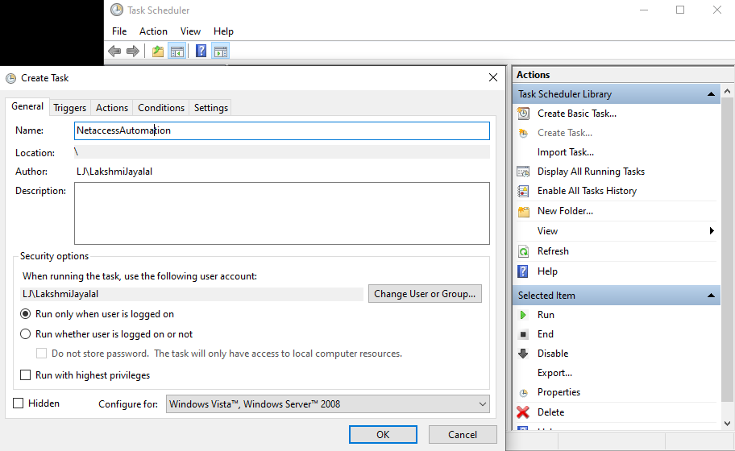
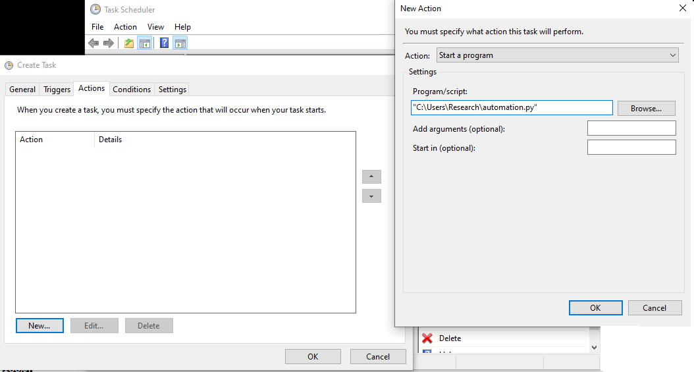

# Requirements 
1. Selenium
2. Python (seperate environment if possible)

# OS - Windows
# How to:

1. Edit the batch file automation.bat \n
2. Add your LDAP Username and LDAP Password in the py code. .(keep in a secure location as anyone having access to this file can see your username and password)
3. Open the taskScheduler 
4. Click on create task and fill in the details 
5. Goto Actions, create a new one. In the script portion add loction to your bat (batch file). 
6. Goto triggesrs - set time whenever you want to run the netaccess script. 
7. Save.

Caution: Always try to run it once attended before leaving it unattended to ensure seemless access

## Happy networking! 
